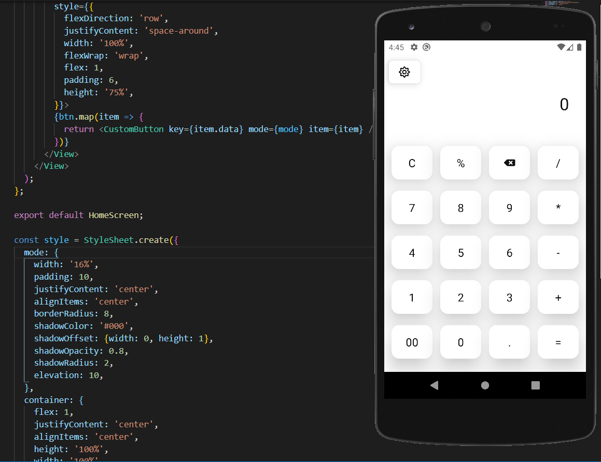
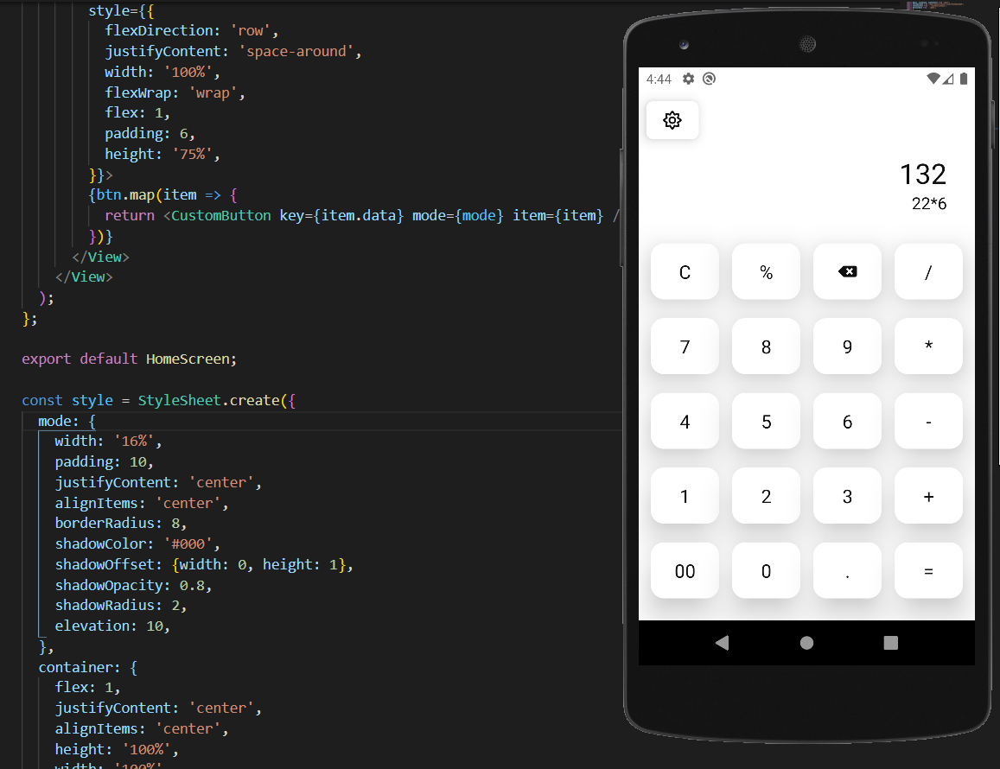
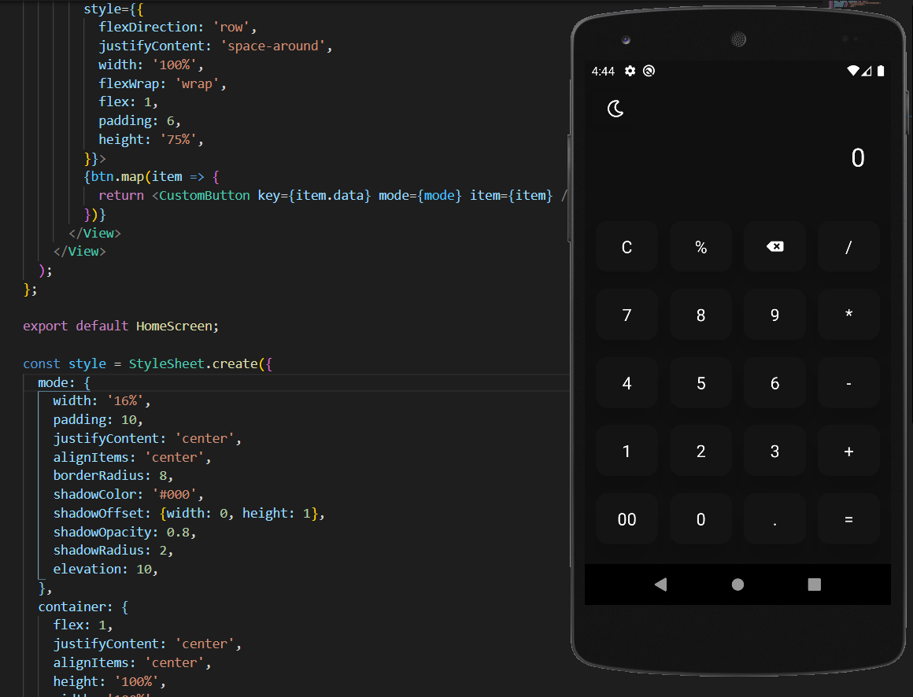
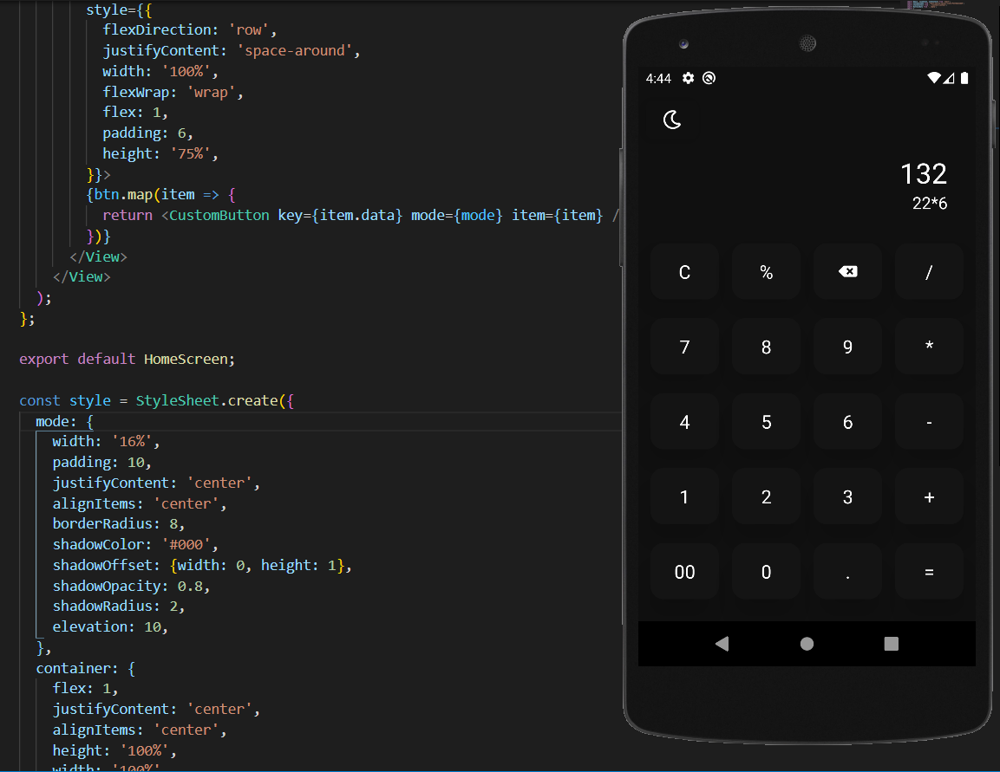

# Calculator App 📱

A Simple cross platform (ios and Android) Calculator App Built in React Native

 * Basic Calculator App
 * Light and Dark Mode
 * Context API for State Management
 * Beautiful UI

 # Screenshots 📸

# Light Mode



<br />
<br />



<br />
<br />


# Dark Mode




<br />
<br />




<br />
<br />


# Development Setup

Clone the repository and run the following commands:
```shell
npm install
npm start
npm run android (for android)
npm run ios (for ios)
```
